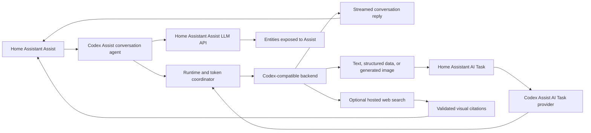

# Architecture

Codex Assist is a Home Assistant custom integration backed by Codex / ChatGPT access. It registers a native Assist conversation agent and a native AI Task provider.

## Main components

- **Config flow** handles Codex-style device-code sign-in. It stores OAuth tokens in the Home Assistant config entry and exposes integration options.
- **Model discovery** offers a curated fallback model list. Once authenticated, it can ask the Codex backend for model IDs available to that account.
- **Conversation agent** registers `conversation.codex_assist` for Home Assistant Assist pipelines.
- **AI Task entity** registers a native provider for text, structured data, supported image attachments, and image generation.
- **Runtime token coordinator** serializes refresh-token rotation per config entry. Concurrent Conversation and AI Task requests reuse the winning refresh instead of invalidating one another.
- **Codex client** sends requests to the Codex-compatible service interface and normalizes its response stream.
- **Native transcript state** retains completed provider output items for stateless replay. The state is deep-copy isolated and remains opaque to normal Home Assistant logs, listeners, and conversation traces, which receive only redacted metadata.
- **Hosted web search** is an explicit option. When enabled, it adds the backend `web_search` tool and converts structured URL annotations into a validated source card. Unsupported or unsafe citation URLs are discarded.
- **Assist tool bridge** maps model-requested device actions into Home Assistant's Assist LLM API. It does not call services directly.

## Assist conversation flow

1. Home Assistant sends a voice or chat request through an Assist pipeline using `conversation.codex_assist`.
2. Codex Assist refreshes its stored Codex or ChatGPT token if needed.
3. Codex Assist sends the conversation to the Codex-compatible backend.
4. If Codex requests a Home Assistant tool call, Codex Assist maps that request into Home Assistant's Assist LLM API.
5. Home Assistant validates and executes the tool call using its normal exposed-entity controls.
6. When hosted search is enabled, Codex Assist keeps validated citations in a displayed card and instructs the model to keep raw URLs and source blocks out of spoken prose.
7. Codex Assist returns the final response to Home Assistant.

For stateless multi-turn requests, Codex Assist keeps completed provider output items in Home Assistant's in-memory chat log and replays them before later user or function-output items. This can include encrypted reasoning state and assistant message phase. The integration does not decrypt that state. Native state is removed from normal delta listeners, uses redacted debug formatting, and serializes as an item count rather than provider content in conversation traces.

## AI Task flow

1. Home Assistant sends an AI Task request to the Codex Assist AI Task entity.
2. For data-generation tasks, Codex Assist translates the instructions and supported image attachments into Codex-compatible input items.
3. If Home Assistant supplies a structure, Codex Assist sends it as a native JSON Schema response format and validates the returned data against that structure. Hosted web search stays disabled for this path so citations cannot invalidate the result.
4. For image-generation tasks, Codex Assist requests an image using the configured quality and size.
5. Codex Assist returns text, structured data, or generated image bytes through Home Assistant's native AI Task result types.

Normal Assist conversation surfaces may not expose an upload button even though Home Assistant chat-log objects can carry attachments internally. Use AI Task surfaces that advertise attachment support when testing native attachments.

## Security boundary

Codex or ChatGPT may suggest an action, but Home Assistant remains the execution boundary. Device control goes through Home Assistant's Assist LLM API and is limited to entities exposed to Assist.

Prompts, conversation context, supported AI Task attachments, and hosted-search requests leave the Home Assistant instance when the corresponding feature is used. See [../SECURITY.md](../SECURITY.md) for the full data and control boundaries.

## Intentional non-goals

Codex Assist should not:

- add a custom raw Home Assistant service-call bridge;
- bypass Home Assistant's Assist exposure model;
- require users to expose every entity in their Home Assistant instance;
- add a separate attachment-upload service;
- run a separate always-on local Codex server;
- store screenshots, device codes, access tokens, refresh tokens, cookies, or private Home Assistant URLs in the repository.

## Upstream compatibility

Codex Assist follows the authentication approach used by the official OpenAI Codex CLI. The downstream Codex service interface is not presented as a stable public API contract for third-party Home Assistant integrations. Compatibility may change with upstream Codex updates.
